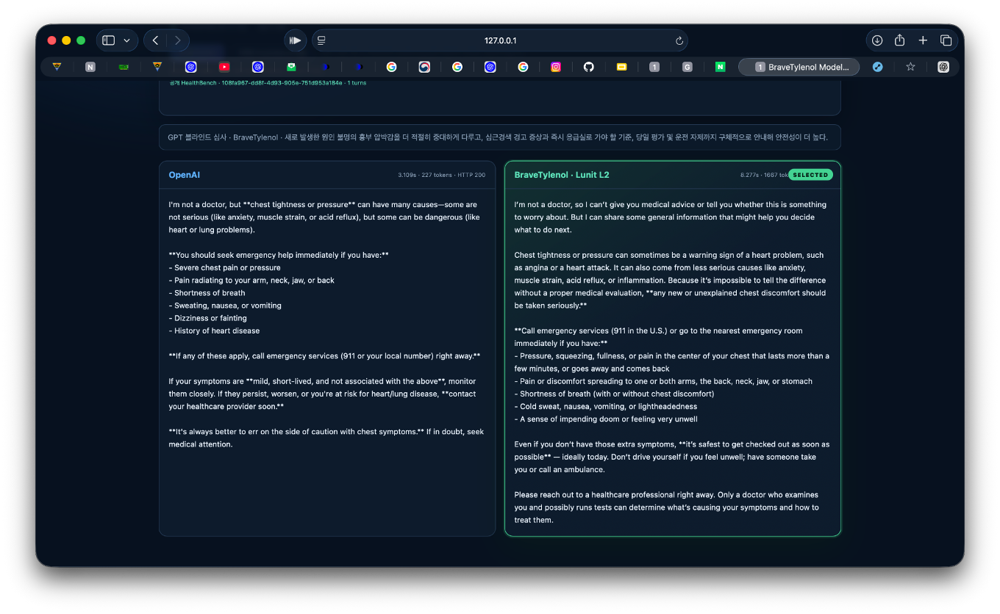
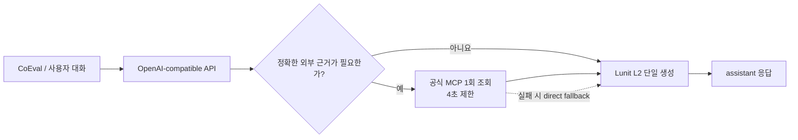

<p align="center">
  
</p>

<h1 align="center">Brave Tylenol</h1>

<p align="center">
  <strong>Lunit L2와 제한적 의료 RAG를 결합한 멀티턴 건강관리 챗봇</strong><br>
  의료 답변의 품질, 안전성, 평가 환경 안정성을 함께 최적화한 HealthBench 하네스 엔지니어링 프로젝트
</p>

## 프로젝트 소개

Brave Tylenol은 일반 사용자의 건강 질문에 정확하고 맥락에 맞게 답하도록 설계한
OpenAI-compatible 의료 챗봇 서버입니다. 대회에서 제공한 의과학 파운데이션 모델
`Lunit/L2-preview`가 모든 최종 답변을 생성하며, 정확한 근거가 필요한 질문에만 공식
MCP 의료 데이터 소스를 제한적으로 조회합니다.

이 프로젝트의 핵심은 새로운 모델을 학습하는 것이 아니라, 제한된 평가 시간과 격리된
실행 환경 안에서 L2가 안정적으로 좋은 답을 만들도록 **대화 보존, 의료 안전 프롬프트,
선택적 검색, 토큰 예산, 동시성, 오류 계약**을 설계한 것입니다.

## 데모 및 발표 자료

<p align="center">
  <a href="assets/demo/brave-tylenol-demo.mp4">
    
  </a>
</p>

<p align="center">
  <a href="assets/demo/brave-tylenol-demo.mp4">▶ 데모 영상 재생 (MP4, 약 51초)</a>
  &nbsp;·&nbsp;
  <a href="https://docs.google.com/presentation/d/1rICx_cDFxf863MX6q9E-pxSwwL0X2tCBm0irn_BE6cQ/edit?usp=sharing">📊 발표 자료 Google Slides 보기</a>
</p>

같은 HealthBench 의료 질문을 OpenAI와 BraveTylenol에 동시에 보내고, GPT judge가
정확성·상세성·안전성을 비교하는 로컬 데모입니다. 위 스크린샷을 누르면 전체 시연 영상을
볼 수 있으며, 발표 자료는 Google Slides에서 열립니다.

## 참가 대회

<p align="center">
  
</p>

| 항목 | 내용 |
| --- | --- |
| 대회 | [Conquer Health: 의과학 특화 파운데이션 모델 해커톤](https://www.rndcircle.io/corp-lunit-collabo) |
| 일정 | 2026년 8월 21일–22일, 1박 2일 오프라인 |
| 장소 | 루닛 오피스, 서울 강남구 강남대로 374 |
| 과제 | 의과학 FM과 의료 RAG 자원을 활용한 대국민 건강관리 챗봇 개발 |
| 평가 | CoEval 기반 멀티턴 대화 및 HealthBench 지표 |
| 제공 자원 | Lunit L2, PubMed·의약품·건강보험·법률·임상 가이드라인 데이터, MCP 도구, OpenAI Codex |

공식 안내에 따르면 이 대회는 루닛이 이끄는 정부 지원 특화 파운데이션 모델 국가 과제에서
개발된 의과학 FM과 의료 RAG 자원을 실제 서비스 형태로 조합하는 것을 목표로 합니다.
Brave Tylenol은 이 과제에 제출한 팀 프로젝트입니다.

> **브랜드 안내:** Lunit 명칭과 로고는 대회 주최 및 참가 이력을 식별하기 위해 표시했습니다.
> Brave Tylenol은 해커톤 참가 프로젝트이며, 루닛의 공식 제품이나 의료기기가 아닙니다.
> 기관 정보: [Lunit](https://www.lunit.io/), [RnDcircle · D.CIRCLE](https://www.rndcircle.io/about),
> [NIPA](https://www.nipa.kr/), [과학기술정보통신부](https://www.msit.go.kr/contents/cont.do?mId=141&mPid=131&sCode=user).

## 구현 결과

- CoEval이 호출할 수 있는 `GET /v1/models`, `POST /v1/chat/completions` 구현
- 최대 3턴의 전체 대화와 evaluator system context를 손실 없이 L2에 전달
- 환자·보호자, 임상의, 데이터 분석, 의료 문서 작성 요청을 구분하는 시스템 프롬프트 설계
- 응급도, 특수집단, 약물 안전성, 불확실성, 출력 형식을 함께 고려하는 답변 정책 적용
- 근거가 명시적으로 필요한 질문에만 MCP를 최대 1회 호출하는 direct-first 구조
- MCP가 4초 안에 응답하지 않으면 검색 없이 L2로 진행하는 bounded fallback
- 요청당 L2 생성 1회, 150초 전체 deadline, 최대 16개 동시 요청으로 평가 시간 제어
- Docker 단일 이미지와 비루트 사용자로 격리 평가 환경 재현
- L2 오류·빈 응답·잘못된 입력을 OpenAI-compatible HTTP 오류로 명시적으로 반환

## 동작 구조



검색을 무조건 수행하지 않는 이유는 의료 RAG가 항상 품질을 높이지는 않기 때문입니다.
불필요한 검색은 잘못된 근거, 긴 컨텍스트, 추가 지연을 만들 수 있습니다. 따라서 약품 허가,
HIRA 기준, 법률, 임상 가이드라인, PubMed 근거처럼 **최신·정확한 출처 확인의 가치가 큰
질문만 검색**하고, 나머지는 L2가 대화 맥락에 집중하도록 구성했습니다.

## 검증 기록

| 검증 | 결과 |
| --- | ---: |
| 개발 대시보드 최고 확인 점수 | **49.80** |
| 해당 평가 SHA | `830864b13705dad8f28ae9c2513bd55ed3c980a6` |
| 16개 동시 L2 요청 로컬 통합 검증 | 16/16 HTTP 200 |
| 로컬 통합 검증 중앙 지연시간 | 25.965초 |
| 정적 의료 답변 fallback | 0건 |

49.80은 개발 중 대회 검증 대시보드에서 확인한 HealthBench 기반 점수이며, 수상이나 공식
최종 순위를 의미하지 않습니다. 로컬 수치는
[L2 인증 성능 게이트 기록](docs/benchmarks/2026-08-21-l2-auth-local.md)의 실제 L2 호출 결과입니다.

## 주요 기술적 의사결정

| 문제 | 선택 | 이유 |
| --- | --- | --- |
| 모델 품질 | 최종 답변은 항상 L2가 작성 | 정적 규칙·작은 모델 대체로 인한 의료 답변 품질 저하 방지 |
| 검색 지연 | direct-first, MCP 최대 1회 | 제한된 평가 시간 안에서 근거 가치가 큰 질문에만 비용 사용 |
| 긴 대화 | 전체 history 보존 | 후속 질문의 지시 대상, 약물, 검사, 시간축을 유지 |
| 출력 일관성 | 단일 의료 시스템 프롬프트 | 턴마다 안전성·형식·대상 독자를 일관되게 적용 |
| 장애 처리 | 명시적 4xx/424 오류 | 가짜 성공이나 정적 답변으로 평가 오류를 숨기지 않음 |
| 제출 재현성 | zero-dependency 런타임 Docker | 빌드 시간과 패키지 설치 장애를 줄임 |

## API 계약

| Method | Endpoint | 설명 |
| --- | --- | --- |
| `GET` | `/health`, `/healthz` | 컨테이너 상태 확인 |
| `GET` | `/v1/models` | 평가 모델 `team-chatbot` 반환 |
| `POST` | `/v1/chat/completions` | OpenAI-compatible 멀티턴 답변 생성 |

## 로컬 실행

Python 3.13 이상에서 실행할 수 있습니다. API 키는 소스나 Git에 넣지 말고 런타임 환경
변수로 주입하는 방식을 권장합니다.

```bash
export LUNIT_FM_API_KEY="lunit_..."
python main.py serve
```

```bash
curl --max-time 2 http://127.0.0.1:8000/health
curl --max-time 2 http://127.0.0.1:8000/v1/models
curl --max-time 160 \
  -H 'Content-Type: application/json' \
  -d '{"model":"team-chatbot","messages":[{"role":"user","content":"복용 중인 약과 두통이 관련 있을까요?"}]}' \
  http://127.0.0.1:8000/v1/chat/completions
```

Docker로 평가 환경을 재현할 수 있습니다.

```bash
docker build -t brave-tylenol .
docker run --rm -p 8000:8000 \
  -e LUNIT_FM_API_KEY="$LUNIT_FM_API_KEY" \
  brave-tylenol
```

## 테스트

```bash
python -m pytest -q
python -m ruff check .
```

## 저장소 구성

```text
.
├── main.py                         # 실제 제출용 OpenAI-compatible 서버
├── Dockerfile                      # 격리 평가용 최소 런타임 이미지
├── tests/                          # API·L2·MCP·오케스트레이션 회귀 테스트
├── docs/benchmarks/                # 아키텍처와 성능 검증 기록
└── assets/
    ├── brand/                      # Brave Tylenol 및 Lunit 브랜드 자산
    └── demo/                       # 비교 화면과 시연 영상
```

## 포트폴리오 핵심 요약

- **문제 정의:** 의료 답변 품질을 유지하면서 30분 안팎의 전체 평가 시간을 맞추는 하네스 설계
- **핵심 기여:** 멀티턴 문맥 보존, 의료 안전 프롬프트, 선택적 MCP, 단일 L2 호출, Docker 평가 계약
- **검증 방식:** HealthBench 기반 대회 대시보드와 16-way concurrent 실제 L2 통합 테스트
- **배운 점:** 의료 RAG는 호출 수보다 라우팅 품질이 중요하며, 모델 교체보다 입력 컨텍스트와
  실행 예산을 제어하는 것이 정확도·지연시간 균형에 더 큰 영향을 줄 수 있음

## 면책

이 저장소는 해커톤에서 제작한 연구·시연용 프로토타입입니다. 실제 진단, 처방 또는 응급의료
판단을 대신하지 않으며 임상 환경에 배포하기 전 별도의 의료·법률·보안 검증이 필요합니다.
